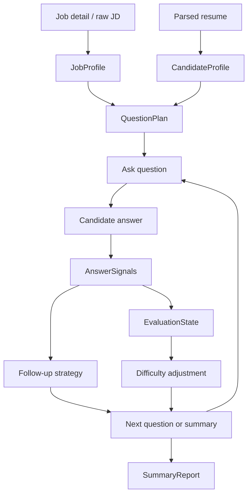

# Interview Agent Story

The simulated interview assistant is the strongest product story in Qingcheng AI. It is not a free-form chatbot. It is a small state-machine Agent that interviews against the intersection of a job profile and a candidate resume.

## State Machine



## Runtime Contract

Persisted in `interview_sessions.report.agent_state`:

- `job_profile`: title, company, level, domain tags, required skills, responsibilities, interview focus.
- `candidate_profile`: parsed resume summary, projects, skills, matched skills, missing skills.
- `question_plan`: planned questions before the first round.
- `asked_questions`: every question, answer, answer signals, and chosen follow-up strategy.
- `evaluation_state`: technical depth, practical experience, communication, problem solving, ownership, role fit, confidence, evidence.
- `difficulty`: 1 to 5, adjusted after each answer.
- `remaining_focus`: focus areas not yet covered.

## Evidence Chain

The report exposes a compact evidence chain:

```json
{
  "question_id": "q-1",
  "round_index": 1,
  "question_focus": "RAG 工程化",
  "job_requirement": "岗位要求 FastAPI、Qdrant、RAG 工程化",
  "resume_evidence": "InternAgent 项目包含 FastAPI、Qdrant、RAG",
  "answer_signal_summary": {
    "completeness": 4,
    "depth": 4,
    "specificity": 5,
    "ownership": 4
  },
  "followup_reason": "回答有项目证据，继续挑战关键假设和失败场景"
}
```

## Golden Scenario

The eval suite includes a three-round scenario:

1. A vague answer triggers `clarify`.
2. A concrete project answer triggers `challenge` or `transfer`.
3. The final round produces `summary_report` with score dimensions and evidence chain.

This is the interview-ready explanation: the assistant asks because of the job and resume, follows up because of answer signals, and scores with evidence instead of a single subjective number.

## Boundaries

- The interview assistant does not read AI assistant chat history.
- The interview assistant does not use the AI assistant RAG knowledge base by default.
- Shared facts are allowed: resume, job, application records, user profile.
- Long-term interview memory is scoped to `assistant_type='interview_assistant'`.
- No MCP tool execution is added here yet; only hooks are reserved.

